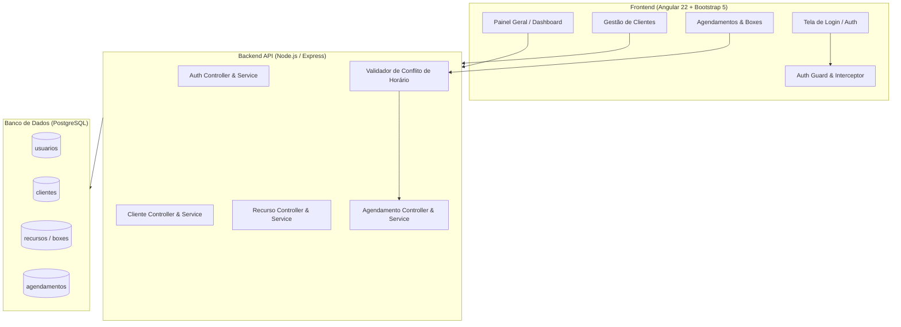
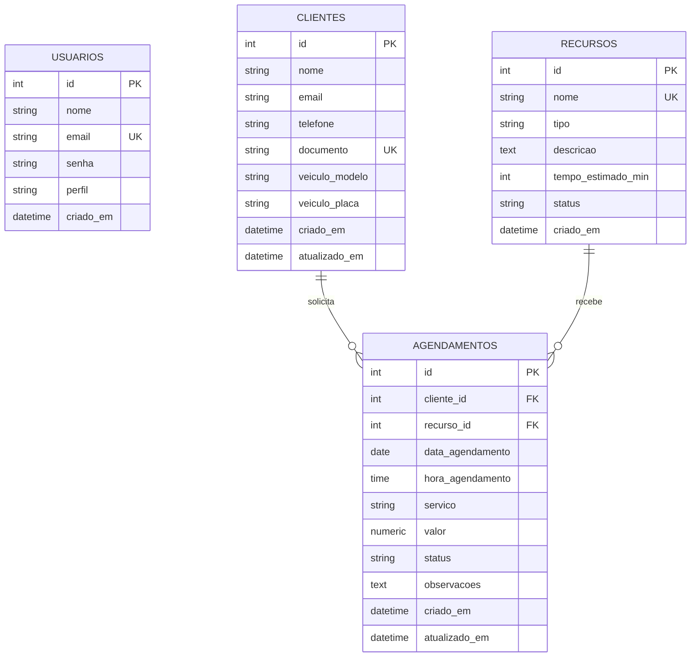

# Apex Detailing - Sistema Inteligente de Agendamento (White-Label)

[](https://angular.dev/)
[](https://nodejs.org/)
[](https://www.postgresql.org/)
[](https://getbootstrap.com/)

> **Versão Temática:** Centro de Estética Automotiva (Detailing / Lava Rápido)  
> **Foco Principal:** Gestão de Clientes e Agendamento de Boxes com **Prevenção Estrita de Sobreposição de Horários (Anti Double-Booking)**.

---

## Índice

1. [Visão Geral e Contexto](#-visão-geral-e-contexto)
2. [Arquitetura do Sistema](#-arquitetura-do-sistema)
3. [Entregas e Documentação (Anexo III)](#-entregas-e-documentação-anexo-iii)
4. [Diagrama Entidade-Relacionamento (DER)](#-diagrama-entidade-relacionamento-der)
5. [Regra de Negócio: Anti Double-Booking](#-regra-de-negócio-anti-double-booking)
6. [Estrutura de Pastas](#-estrutura-de-pastas)
7. [Endpoints da API REST](#-endpoints-da-api-rest)
8. [Como Executar o Projeto](#-como-executar-o-projeto)
9. [Casos de Teste Homologados](#-casos-de-teste-homologados)

---

## Visão Geral e Contexto

O **Apex Detailing** é um sistema White-Label desenvolvido para centros de estética automotiva, estúdios de detalhamento (*detailing*) e lava-rápidos premium. O objetivo central é eliminar cadernos de papel e planilhas confusas, garantindo que nenhum Box de lavagem, polimento ou vitrificação seja reservado em duplicidade para o mesmo dia e horário.

### Destaques da Solução
- **Frontend em Angular 22:** Single Page Application (SPA) responsiva, componentes standalone, interceptors de autenticação, feedback visual imediato e CSS limpo integrado ao Bootstrap 5.
- **Backend REST em Node.js:** Arquitetura em camadas (Controllers, Services, Repositories, Middlewares), princípios SOLID, funções enxutas (máx. 20 linhas) e comentários em `pt-BR`.
- **Banco de Dados PostgreSQL:** Banco `saep_agendamento_db` estruturado com chaves estrangeiras, índices de performance e restrições de integridade.
- **5 Boxes de Estética Especializados:** Pré-configurados na base de dados e carregados dinamicamente nos formulários.

---

## Arquitetura do Sistema



---

## Entregas e Documentação (Anexo III)

Todas as 10 entregas exigidas pelo desafio técnico estão organizadas e documentadas no projeto:

| Nº | Entrega | Tipo de Entrega | Localização no Projeto |
|:--:|---|---|---|
| **1** | Lista de requisitos funcionais | Documentação de requisitos | `docs/requisitos_e_infraestrutura_anexo_iii.md` |
| **2** | Diagrama Entidade-Relacionamento (DER) | Modelagem em Imagem (.png) | `docs/der_estetica_automotiva.png` |
| **3** | Script de criação e população do BD | Script SQL (`saep_agendamento_db`) | `database/saep_agendamento_db.sql` |
| **4** | Backend (API REST em Node.js) | Desenvolvimento de API | `backend/src/` |
| **5** | Tela de Login com feedback de erro | Angular Component | `frontend/src/app/components/login/` |
| **6** | Interface Principal com nome do usuário e logout | Angular Layout | `frontend/src/app/components/navbar/` & `dashboard/` |
| **7** | Cadastro, busca e exclusão de Clientes | Angular CRUD Grid | `frontend/src/app/components/clientes/` |
| **8** | Agendamentos com Dropdown Dinâmico de Boxes | Angular Feature | `frontend/src/app/components/agendamentos/` |
| **9** | Casos de Teste de Software | Documentação de Testes | `docs/requisitos_e_infraestrutura_anexo_iii.md` |
| **10** | Requisitos de Infraestrutura | Documentação do Sistema | `docs/requisitos_e_infraestrutura_anexo_iii.md` |

---

## Diagrama Entidade-Relacionamento (DER)

A modelagem relacional do banco de dados `saep_agendamento_db` foi concebida para atender à alta performance e integridade:



### Recursos / Boxes Populados Inicialmente:
1. **Box 01 - Lavagem Detalhada & Snow Foam** (Lavagem técnica, shampoo neutro e secagem filtrada)
2. **Box 02 - Polimento Técnico & Correção** (Cabine LED para remoção de micro-riscos e hologramas)
3. **Box 03 - Vitrificação Cerâmica & Nano** (Ambiente climatizado para cura de cerâmicas 9H)
4. **Box 04 - Higienização Interna & Oxi** (Vaporização, hidratação de couro e oxi-sanitização)
5. **Box 05 - Estufa de Secagem & Aplicação PPF** (Box estéril para Paint Protection Film)

---

## Regra de Negócio: Anti Double-Booking

Para prevenir conflitos de agenda:
1. Ao enviar um novo agendamento, o backend executa a consulta:
   ```sql
   SELECT * FROM agendamentos 
   WHERE recurso_id = $1 AND data_agendamento = $2 AND hora_agendamento = $3 AND status != 'CANCELADO';
   ```
2. Caso exista registro ativo para o mesmo Box no mesmo dia e horário:
   - A API responde com status **`409 Conflict`** e a mensagem:
     `Conflito de Horário: O [Nome do Box] já possui um agendamento para a data [Data] às [Hora]. Escolha outro horário ou outro Box.`
   - O Angular intercepta a resposta e projeta um **Alerta Visual Vermelho com Animação** no modal, bloqueando o salvamento.

---

## Estrutura de Pastas

```text
Estetica_Automotiva/
├── backend/                        # API REST em Node.js
│   ├── src/
│   │   ├── config/database.js      # Conexão PostgreSQL e auto-seed
│   │   ├── controllers/            # Controladores REST enxutos (<= 20 linhas)
│   │   ├── middlewares/            # Auth JWT e Handler global de erros
│   │   ├── repositories/           # Camada de persistência SQL
│   │   ├── routes/                 # Rotas da API (/auth, /clientes, /recursos, /agendamentos)
│   │   ├── services/               # Regras de negócio e motor anti double-booking
│   │   └── server.js               # Inicializador do Express
│   ├── .env                        # Variáveis de ambiente
│   ├── package.json
│   └── test_api.js                 # Bateria de testes automatizados dos endpoints
│
├── frontend/                       # Aplicação SPA em Angular 22
│   ├── src/
│   │   ├── app/
│   │   │   ├── components/
│   │   │   │   ├── agendamentos/   # Listagem e Modal com Dropdown dinâmico e Alerta de Conflito
│   │   │   │   ├── clientes/       # Tabela, Busca em tempo real e Modais de CRUD
│   │   │   │   ├── dashboard/      # Cards de KPIs e visualização dos Boxes
│   │   │   │   ├── login/          # Autenticação com feedback em caso de falha
│   │   │   │   └── navbar/         # Header com nome do operador e botão de logout
│   │   │   ├── guards/             # Proteção de rotas autenticadas
│   │   │   ├── interceptors/       # Injeção automática de token JWT
│   │   │   ├── models/             # Interfaces TypeScript
│   │   │   ├── services/           # Comunicação HTTP com a API REST
│   │   │   ├── app.routes.ts       # Roteamento central
│   │   │   └── app.config.ts
│   │   └── styles.css              # CSS global integrado com Bootstrap 5 e tema dark
│   └── angular.json
│
├── database/
│   └── saep_agendamento_db.sql     # Script completo de DDL e DML com os 5 Boxes
│
└── docs/
    ├── der_estetica_automotiva.png # Imagem do Diagrama Entidade-Relacionamento
    └── requisitos_e_infraestrutura_anexo_iii.md # Documentação formal Anexo III
```

---

## Endpoints da API REST

| Método | Endpoint | Protegido | Descrição |
|---|---|:---:|---|
| `POST` | `/api/auth/login` | Não | Autentica usuário e retorna JWT |
| `GET` | `/api/auth/me` | Sim | Retorna dados do usuário logado |
| `GET` | `/api/recursos` | Sim | Lista todos os boxes de estética automotiva |
| `GET` | `/api/recursos/:id` | Sim | Retorna detalhes de um box |
| `GET` | `/api/clientes` | Sim | Lista clientes (suporta `?busca=nome_ou_cpf`) |
| `POST` | `/api/clientes` | Sim | Cadastra novo cliente e veículo |
| `PUT` | `/api/clientes/:id` | Sim | Atualiza dados cadastrais de um cliente |
| `DELETE` | `/api/clientes/:id` | Sim | Remove um cliente |
| `GET` | `/api/agendamentos` | Sim | Lista histórico completo de agendamentos |
| `POST` | `/api/agendamentos` | Sim | Cria agendamento (**Validação de Conflito**) |
| `PATCH` | `/api/agendamentos/:id/status` | Sim | Altera status (AGENDADO, FINALIZADO, CANCELADO) |
| `DELETE` | `/api/agendamentos/:id` | Sim | Exclui um agendamento |
| `GET` | `/api/dashboard/stats` | Sim | Retorna indicadores e métricas consolidadas |

---

## Como Executar o Projeto

### Pré-requisitos
- [Node.js](https://nodejs.org/) v18+ (testado em v24.16.0)
- [PostgreSQL](https://www.postgresql.org/) v14+ (porta padrão 5432)

### 1. Configuração do Banco de Dados
Abra o PostgreSQL e execute o script:
```bash
psql -U postgres -f database/saep_agendamento_db.sql
```
*(Ou deixe a API inicializar, pois ela verifica e cria a estrutura automaticamente).*

### 2. Executando o Backend (API)
```bash
cd backend
npm install
npm start
```
> A API estará disponível em: `http://localhost:3000`

Para rodar a bateria de testes automatizados da API e conflito de horário:
```bash
node test_api.js
```

### 3. Executando o Frontend (Angular)
```bash
cd frontend
npm install
npm start
```
> O Frontend estará acessível no navegador em: `http://localhost:4200`

### Credenciais de Acesso Padrão:
- **E-mail:** `admin@estetica.com`
- **Senha:** `admin123`

---

## Casos de Teste Homologados

Todos os 10 casos de teste especificados no Anexo III foram implementados e validados:

- **CT01 (Login Inválido):** Exibe alerta explicativo em vermelho caso a senha ou e-mail estejam incorretos.
- **CT02 (Login Válido):** Autentica com sucesso, armazena token JWT e redireciona ao painel.
- **CT03 / CT04 (Cadastro de Cliente & Validação):** Validação visual de campos obrigatórios e gravação com feedback.
- **CT05 (Busca Dinâmica):** Filtragem em tempo real na tabela por nome do cliente ou documento.
- **CT06 (Dropdown Dinâmico de Boxes):** População automática a partir da API com os 5 boxes temáticos.
- **CT07 (Agendamento Regular):** Gravação de agendamento em horário livre com sucesso.
- **CT08 (Bloqueio de Double-Booking):** Tentativa de reservar o mesmo Box na mesma Data e Hora retorna erro 409 e exibe banner de alerta bloqueando o salvamento.
- **CT09 (Cancelamento de Agendamento):** Atualização de status para 'CANCELADO' com liberação imediata do box.
- **CT10 (Logout Seguro):** Limpeza da sessão e retorno à tela de login.
