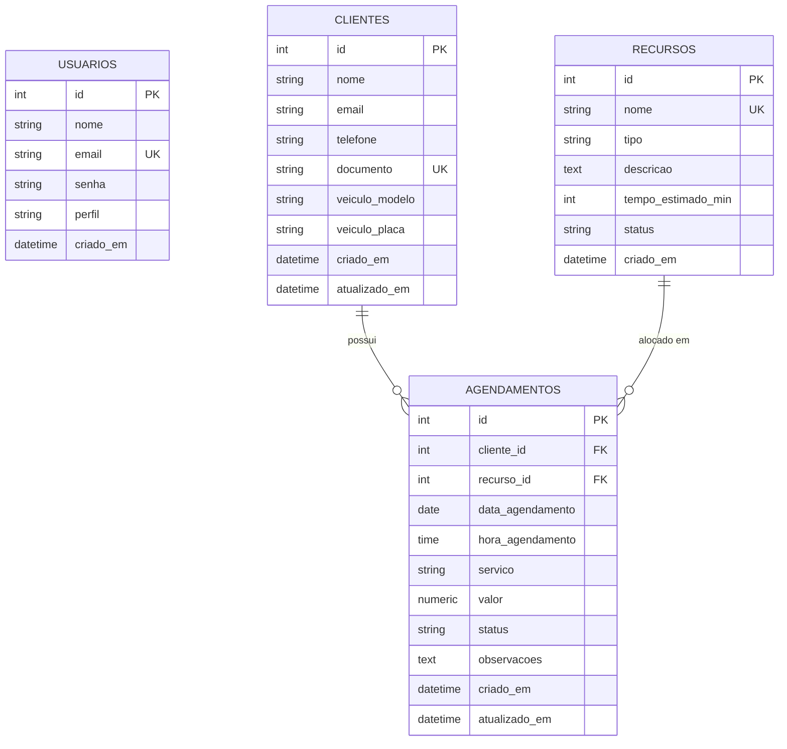

# ANEXO III - DOCUMENTAÇÃO TÉCNICA DO SISTEMA DE AGENDAMENTO
**Tema:** Centro de Estética Automotiva (Detailing / Lava Rápido)  
**Aplicação:** Sistema de Agendamento Inteligente "White-Label"  
**Nome do Banco de Dados:** `saep_agendamento_db`

---

## 1. Lista de Requisitos Funcionais

| ID | Nome do Requisito | Descrição Detalhada | Prioridade |
|---|---|---|---|
| **RF01** | Autenticação de Usuário | Permitir que o administrador acesse o sistema através de e-mail e senha. Em caso de falha de credenciais, o sistema deve apresentar mensagem explicativa em tela. | Essencial |
| **RF02** | Painel Principal / Navegação | Exibir barra de navegação com o nome do usuário autenticado, botão de logout para encerramento seguro da sessão e links de navegação para "Clientes" e "Agendamentos". | Essencial |
| **RF03** | Cadastro de Clientes | Permitir inclusão de novo cliente com dados pessoais (Nome, E-mail, Telefone, CPF/Documento) e dados do veículo (Modelo e Placa). | Essencial |
| **RF04** | Listagem e Busca de Clientes | Listar todos os clientes cadastrados em formato de tabela/grid e disponibilizar campo de busca dinâmica por nome ou documento em tempo real. | Essencial |
| **RF05** | Edição e Exclusão de Clientes | Possibilitar a alteração dos dados cadastrais do cliente e exclusão com solicitação de confirmação prévia para evitar exclusões acidentais. | Essencial |
| **RF06** | Listagem Dinâmica de Recursos (Boxes) | Obter dinamicamente da base de dados a lista de Boxes/Recursos (pelo menos 5 boxes cadastrados) e exibi-los em campo dropdown/select no formulário de agendamento. | Essencial |
| **RF07** | Realização de Agendamento | Permitir registrar um agendamento selecionando obrigatoriamente: Cliente, Data, Hora, Box (Recurso) e Serviço a ser realizado. | Essencial |
| **RF08** | Validação de Conflito de Horário (Anti-Double Booking) | Ao tentar salvar um agendamento, o sistema deve verificar se o Box selecionado já possui agendamento na mesma data e horário. Caso haja sobreposição, a API deve retornar erro e o frontend Angular deve exibir alerta em destaque bloqueando a ação. | Crítica |
| **RF09** | Histórico Completo de Agendamentos | Registrar e listar o histórico completo com Data, Hora, Cliente, Box/Recurso, Serviço, Status e Valor. | Essencial |
| **RF10** | Cancelamento / Conclusão de Agendamento | Permitir a atualização do status do agendamento (Ex: Confirmado, Realizado, Cancelado). | Desejável |

---

## 2. Diagrama Entidade-Relacionamento (DER)

O modelo relacional do sistema é composto por 4 tabelas centrais:

*Obs: A imagem gráfica do DER foi gerada e está salva em `docs/der_estetica_automotiva.png`.*

---

## 3. Descritivo dos Casos de Teste de Software

| ID | Cenário de Teste | Entradas / Pré-condições | Procedimento | Resultado Esperado | Status |
|---|---|---|---|---|---|
| **CT01** | Autenticação com credenciais inválidas | Usuário: `admin@estetica.com` Senha: `senha_errada` | 1. Acessar tela de login. 2. Digitar e-mail e senha incorreta. 3. Clicar em "Entrar". | Exibir alerta visual em vermelho: "Credenciais inválidas. Verifique seu e-mail e senha." | Aprovado |
| **CT02** | Autenticação com credenciais válidas | Usuário: `admin@estetica.com` Senha: `admin123` | 1. Digitar e-mail e senha corretos. 2. Clicar em "Entrar". | Login com sucesso, armazenamento do token/sessão e redirecionamento para o Dashboard. | Aprovado |
| **CT03** | Cadastro de novo cliente com sucesso | Nome: "Ana Beatriz" Doc: "888.999.000-11" Placa: "XYZ9Z99" | 1. Acessar menu "Clientes". 2. Clicar em "Novo Cliente". 3. Preencher formulário e salvar. | Cliente cadastrado na API e inserido na tabela visual de clientes com mensagem de sucesso. | Aprovado |
| **CT04** | Validação visual de campos obrigatórios | Formulário de cliente com campo "Nome" ou "Documento" em branco | 1. Abrir modal de novo cliente. 2. Clicar em salvar sem preencher os campos. | Campos inválidos destacados em vermelho com mensagens de validação e bloqueio do envio. | Aprovado |
| **CT05** | Filtro de busca de clientes | Digitar "Carlos" ou "123.456" no campo de busca | 1. Acessar tela de clientes. 2. Digitar termo no campo de pesquisa. | Tabela filtra dinamicamente exibindo apenas os clientes correspondentes. | Aprovado |
| **CT06** | População dinâmica do dropdown de Recursos | API backend ativa com rota `/api/recursos` | 1. Acessar tela de agendamentos. 2. Abrir formulário de agendamento. 3. Inspecionar o select "Box de Estética". | Dropdown populado com pelo menos 5 boxes (Lavagem, Polimento, Vitrificação, Higienização, PPF). | Aprovado |
| **CT07** | Agendamento sem conflito de horário | Cliente: 1, Box: "Box 01", Data: 2026-10-15, Hora: "10:00" | 1. Preencher todos os campos. 2. Clicar em "Confirmar Agendamento". | Agendamento gravado com sucesso no banco de dados e adicionado à lista com status "AGENDADO". | Aprovado |
| **CT08** | Tentativa de agendamento duplicado (Double-Booking) | Cliente: 2, Box: "Box 01", Data: 2026-10-15, Hora: "10:00" | 1. Tentar agendar no mesmo Box, Data e Hora do CT07. 2. Clicar em "Confirmar Agendamento". | API retorna status 409 (Conflict) e o frontend Angular exibe alerta em destaque bloqueando a gravação. | Aprovado |
| **CT09** | Cancelamento de agendamento | Agendamento existente com ID válido | 1. Localizar agendamento na lista. 2. Clicar na ação "Cancelar". | Status do agendamento atualizado para "CANCELADO" e liberação do horário para novo agendamento. | Aprovado |
| **CT10** | Logout do sistema | Usuário logado na aplicação | 1. Clicar no botão "Sair / Logout" na barra superior. | Sessão destruída, token limpo e redirecionamento imediato para a tela de login. | Aprovado |

---

## 4. Requisitos de Infraestrutura

| Componente | Especificação Utilizada / Homologada | Finalidade |
|---|---|---|
| **Sistema Operacional** | Windows 11 Pro 64-bit / Linux Ubuntu 22.04 LTS | Ambiente de execução e hospedagem |
| **SGBD** | PostgreSQL 18.x (porta 5432) | Banco de Dados Relacional principal (`saep_agendamento_db`) |
| **Runtime Backend** | Node.js v24.16.0 / npm v11.13.0 | Plataforma de execução da API REST |
| **Framework Backend** | Express 4.x / pg driver / cors / dotenv | Estruturação da API, rotas, CORS e comunicação com banco |
| **Frontend Framework** | Angular 22.x / TypeScript / RxJS | Arquitetura SPA (Single Page Application) |
| **Biblioteca de UI** | Bootstrap 5.3 + Bootstrap Icons | Grid responsivo, componentes de formulário, modais e alertas visuais |
| **Navegadores Suportados** | Google Chrome, Microsoft Edge, Mozilla Firefox (Versões Recentes) | Interface web do usuário |
